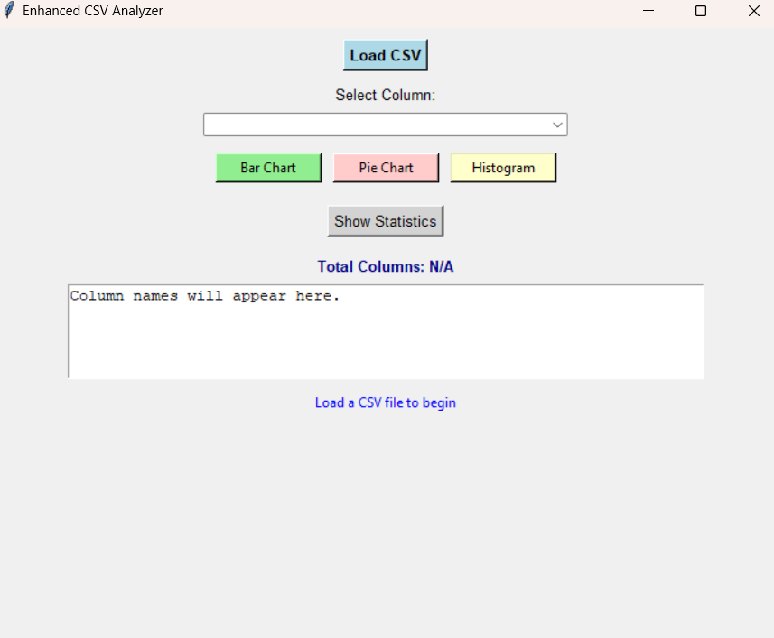
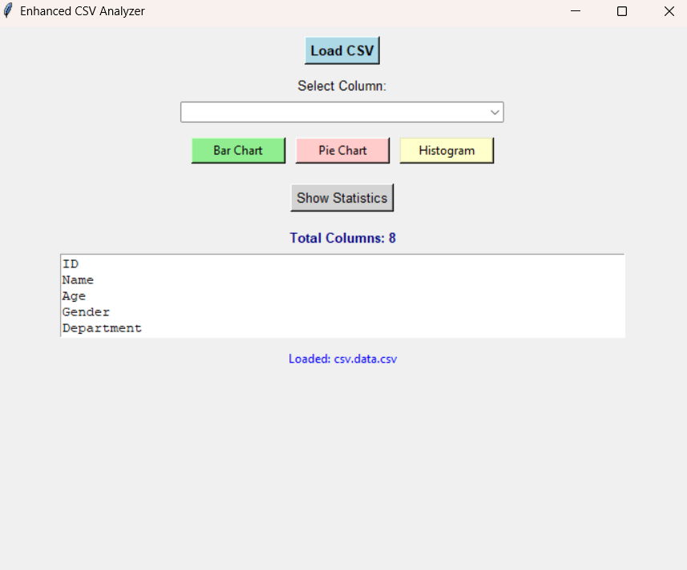
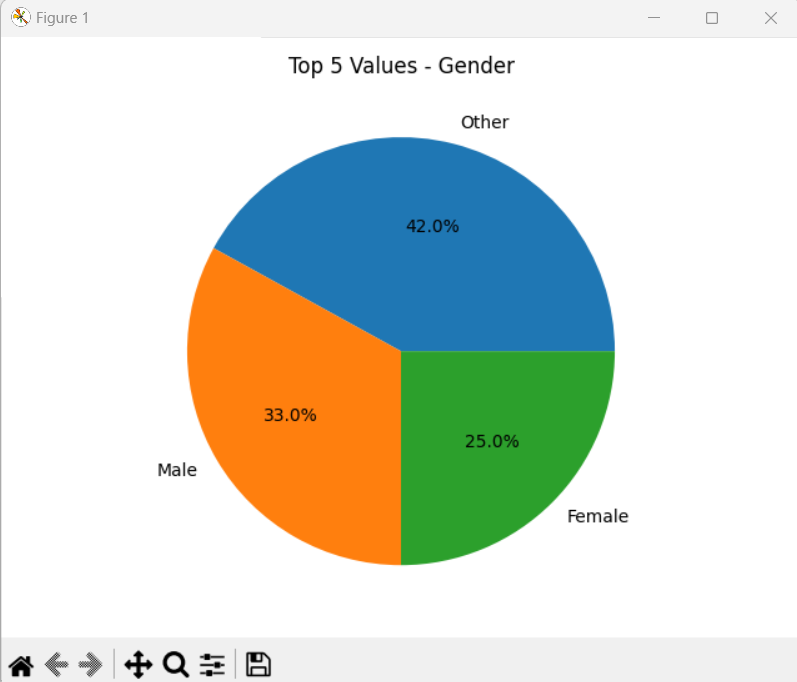
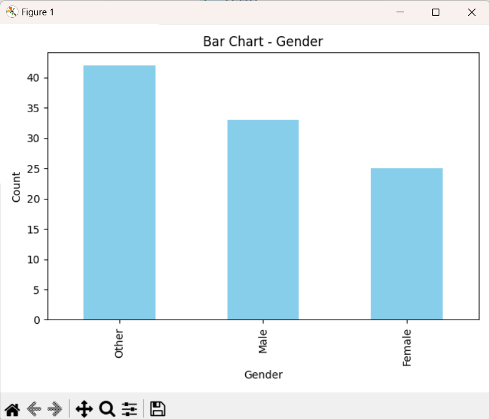

# Enhanced CSV Analyzer

A user-friendly desktop application built with **Tkinter** in Python to load, analyze, and visualize CSV data with multiple chart options and data summary.

---

## Features

- Load any CSV file and automatically detect columns
- Display total number of columns and list all column names
- Interactive dropdown to select columns for analysis
- Generate various visualizations:
  - Bar Chart (categorical data)
  - Pie Chart (categorical data)
  - Histogram (numeric data)
- View detailed summary statistics of the dataset
- Clean, intuitive GUI with easy navigation

---

## Requirements

- Python 3.6+
- pandas
- numpy
- matplotlib

Install required packages with:

```bash
pip install pandas numpy matplotlib
```

## screen shots



